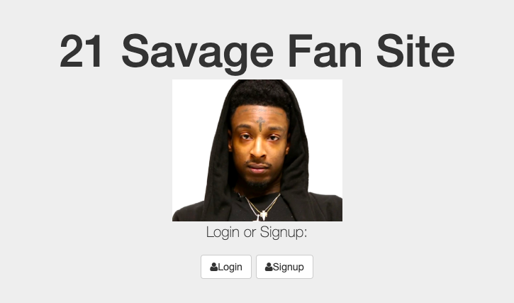

## Installation

1. Clone repo
2. run `npm install`

## Usage

1. run `node server.js`
2. Navigate to `localhost:8080`

Welcome to my 21 Savage Login App!

You can create messages and upvote and downvote your mesages:)

